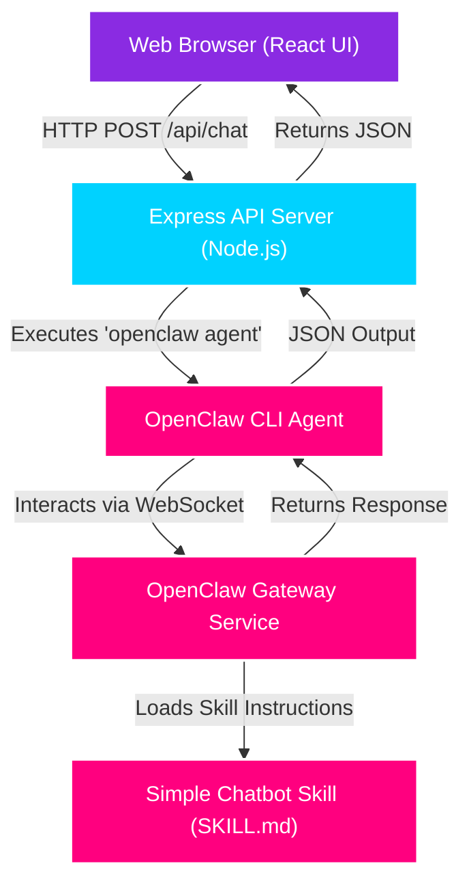

# Simple Chatbot Skill & UI for OpenClaw

This repository contains a custom simple-chatbot skill and a modern React Web UI designed to integrate with the [OpenClaw](https://openclaw.ai) AI assistant framework.

## Project Architecture

The architecture relies on the OpenClaw Gateway as the central engine, with a custom Node/Express backend acting as a bridge for the React UI.



## Folder Structure

*   `/simple-chatbot/` - Contains the `SKILL.md` file which defines the instructions and personality for the OpenClaw agent.
*   `/chatbot-ui/` - Contains the Vite React application and the Express backend server.

## Getting Started

### 1. Link the Skill to OpenClaw
Ensure the `simple-chatbot` directory is linked or copied into your OpenClaw workspace:
```bash
ln -s /path/to/Aggent-skillls/simple-chatbot ~/.openclaw/workspace/skills/simple-chatbot
```

### 2. Run the OpenClaw Gateway
In a terminal window, start the gateway:
```bash
openclaw gateway
```

### 3. Start the UI and Backend
In a separate terminal, navigate to the `chatbot-ui` directory and start the application:
```bash
cd chatbot-ui
npm install
npm run dev
```

This will concurrently start the Vite development server (port 5173) and the Express API server (port 3001).
Open `http://localhost:5173` in your browser to start chatting!
